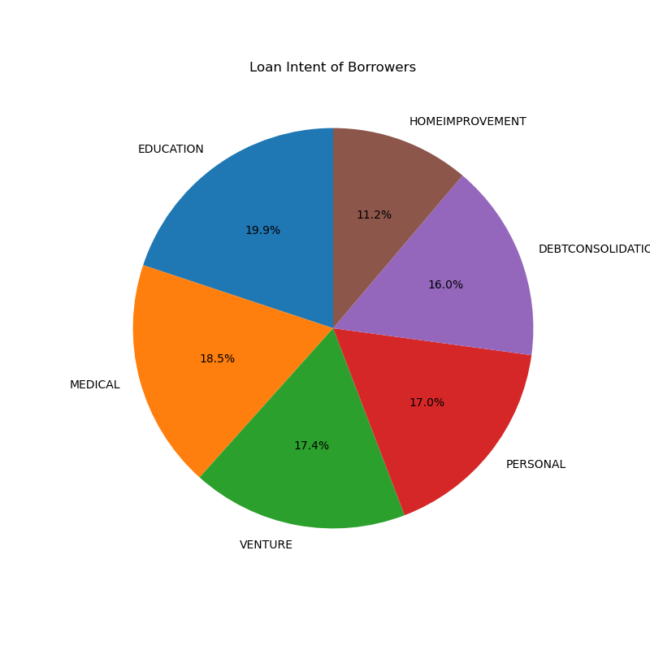
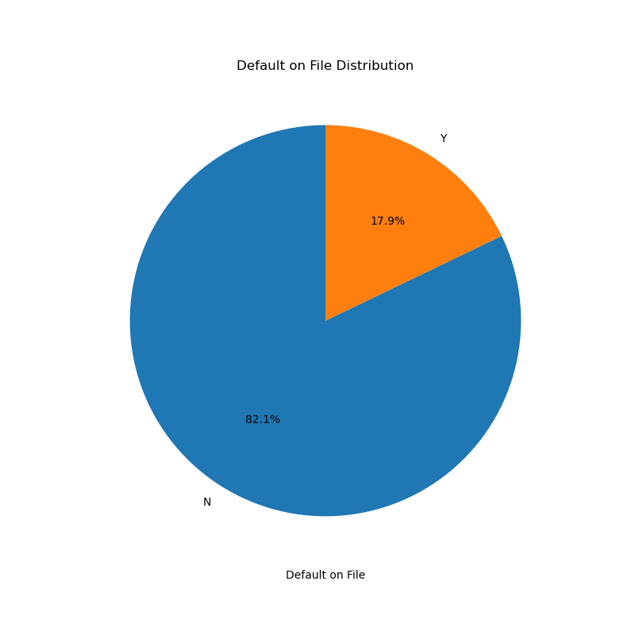
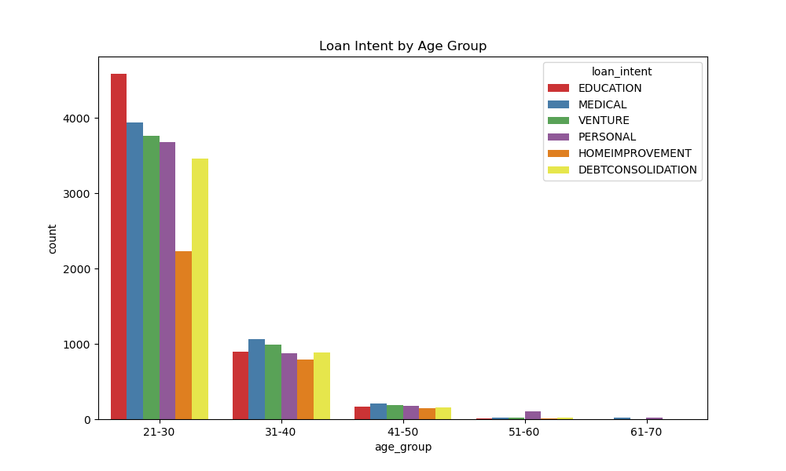
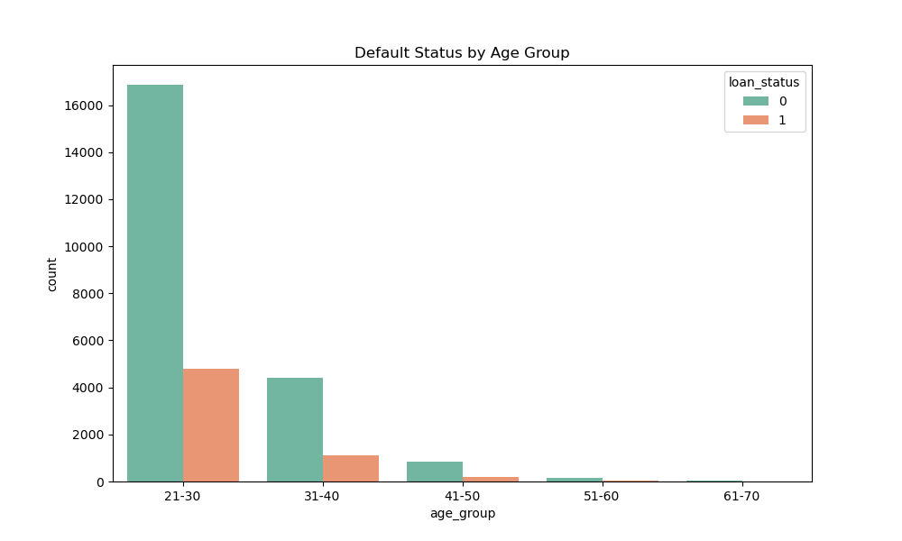

# Credit Risk Assessment and Loan Prediction

## Overview

This project involves analyzing a loan dataset to predict credit risk using loan status and loan amounts. The dataset contains information about borrowers, including age, income, home ownership, employment length, loan intent, and credit history. The analysis includes data preprocessing, exploratory data analysis, and the application of various machine learning models.

For credit risk analysis (classification), models like Decision Trees, Random Forest, Logistic Regression, K-Nearest Neighbors, Gradient Boosting, and XGBoost were used. XGBoost performed best with an accuracy of 93.7% and an F1 score of 0.839. For loan amount prediction (regression), Linear Regression, XGBoost, and Artificial Neural Networks (ANN) were employed. XGBoost outperformed others with an R² of 0.995 and the lowest RMSE of 425.22.

The process involved data cleaning, feature engineering, model training, hyperparameter tuning using GridSearchCV, and performance evaluation using metrics like accuracy, precision, recall, F1 score for classification, and RMSE, MSE, MAE, R² for regression. Feature importance analysis was also conducted to identify the most influential factors in predictions.

**Objectives**

1. Credit Risk Classification: Categorizing loan applicants based on their creditworthiness to make informed decisions about loan approvals and interest rates.
2. Loan Amount Prediction: Predicting suitable loan amounts for approved applicants, balancing their financial needs with the risk of default.

## Business Understanding

### Stakeholders
Business stakeholders include:
- Financial Institutions (Banks, Credit Unions, Lending Companies)
- Loan Applicants (Customers)
- Credit Bureaus and Reporting Agencies
- Regulatory Bodies
- Investors and Shareholders of Financial Institutions
- Loan Officers and Risk Management Teams

### Key Business Questions

1. Which borrower profiles are most likely to default on their loans?
2. What factors most strongly influence loan approval?
3. How can financial institutions optimize loan offerings for different borrower demographics?
4. How effective is machine learning in predicting loan amounts and credit risk?

## Data Understanding and Analysis

### Source of Data

The data for this analysis was obtained from [Kaggle](https://www.kaggle.com/datasets/laotse/credit-risk-dataset?resource=download). It consists of 32,581 observations of 12 variables

### Description of Data

 - person_age: The age of the borrower when securing the loan.
 - person_income: The borrower’s annual earnings at the time of the loan.
 - person_home_ownership: Type of home ownership.
 - person_emp_length: The amount of time in years that the borrower is employed.
 - loan_intent: Loan purpose.
 - loan_grade: Classification system based on credit history, collateral quality, and likelihood of repayment.
    - A: The borrower has a high creditworthiness, indicating low risk.
    - B: The borrower is relatively low-risk, but not as creditworthy as Grade A.
    - C: The borrower’s creditworthiness is moderate.
    - D: The borrower is considered to have higher risk compared to previous grades.
    - E: The borrower’s creditworthiness is lower, indicating a higher risk.
    - F: The borrower poses a significant credit risk.
    - G: The borrower’s creditworthiness is the lowest, signifying the highest risk.
 - loan_amnt: Total amount of the loan.
 - loan_int_rate: Interest rate of the loan.
 - loan_status: Dummy variable indicating default (1) or non-default (0).
 A default occurs when a borrower is unable to make timely payments, misses payments, or avoids or stops making payments on interest or principal owed.
 - loan_percent_income: Ratio between the loan amount and the annual income.
 - cb_person_cred_hist_length: The number of years of personal history since the first loan taken.
 - cb_person_default_on_file: Indicates if the person has previously defaulted.

## Exploratory Data Analysis

#### Analyzing loan intent of borrowers:

- **Analysis**:  Educational purposes represent the highest loan intent percentage at 19.86%. This suggests that a significant portion of borrowers are investing in their education, possibly to further their careers or pursue higher levels of education.On the other hand, home improvement purposes represent the lowest percentage at 11.08%, indicating a smaller but still notable portion are investing in renovating or upgrading their homes..

#### 2. Analyzing Default on File Distribution:

- **Analysis**: 82% of borrowers have a history of defaults on their loans, suggesting that there is a prevalent trend of financial difficulties among borrowers. Conversely, 18% of borrowers stand out for their clean repayment records, indicating a minority who have managed to navigate their financial obligations successfully.

#### 3. Analyzing Loan Intent by age group:

- **Analysis**: Borrowers aged 21-30 are the largest demographic securing loans, with education being the predominant reason and home improvement ranking lowest. This implies a focus on investing in education and potentially early career development among younger borrowers. For borrowers aged 31-40 and 41-50, the primary reason shifts towards medical needs, indicating a growing focus on healthcare in this age group. Finally, for borrowers aged 51-60 and 61-70, personal reasons become the main motivation for loans, reflecting a diverse range of financial needs or aspirations among older individuals. 

#### 4. Analyzing Default Status by Age Group:

- **Analysis**: younger individuals (21-30) are more represented in this dataset, with a much higher count of individuals either not taking loans or defaulting (loan status 0), while fewer people successfully manage their loans (loan status 1)

## Modeling
The project looks at 2 modelling tasks:

1. Credit Risk Classification
2. Loan Amount Prediction

### Credit Risk Classification Modelling
We classified and predicted risk based on the loan status (0 = paid; 1 = unpaid) using various classification models, which performed as shown:

| Model              | Accuracy | Precision | Recall | F1 Score |
|--------------------|-------|-----------|--------|----------|
| Logistic Regression| 0.850123 | 0.750317     | 0.473979  | 0.580962     |
| Decision Tree      | 0.881537 | 0.714179      | 0.766213   | 0.739282     |    
| Random Forest      | 0.933836 | 0.963830      | 0.725380   | 0.827775    | 
| KNN      | 0.886100 | 0.812500      | 0.624500   | 0.706202     |
| Gradient Boosting     | 0.926290 | 0.944266      | 0.705364   | 0.807516     |       
| XGBClassifier      | 0.938224 | 0.957187      | 0.751801   | 0.842152     |

### Loan Amount Prediction
We utilized linear regression as the baseline model and advanced regression algorithms, including XGBoost, and Artificial Neural Networks (ANN), to train models based on key financial indicators such as applicant income, home ownership status, and loan grade. 

| Model              | RMSE | MSE | MAE | R2 |
|--------------------|-------|-----------|--------|----------|
| Linear Regression| 3684.029430 | 1.357207e+07     | 2417.263159  | 0.654791     |      
| ANN      | 630.317444 | 3.973001e+05      | 388.393219   | 0.989895     |     
| XGBClassifier      | 498.285557 | 227.165864      | 0.751801   | 0.993685    |

### Key Results

XGBClassifier (Credit Risk Classification):

The XGBClassifier shows strong performance in credit risk classification, with a high precision of nearly 96%, indicating its strong ability to correctly identify unpaid loans while maintaining an overall accuracy of 93.82%.

XGBRegressor (Loan Amount Prediction):

The XGBRegressor achieved an impressive R² score of 0.9937, indicating that it explains almost all the variance in loan amounts. The low RMSE (498.29) and MAE (751.80) demonstrate the model's high accuracy in predicting loan amounts.

## Model Interpretation

#### XGBClassifier

LIME (Local Interpretable Model-Agnostic Explanations) library was used to generate a visualization which output the following about the XGBClassifier model:

- Prediction Probabilities
- Feature Contributions
- Top Features and Values

Viz

The model predicts with high confidence (98%) that the loan will be paid (class 0).
Features like the person’s income, age, and employment length pushed the prediction toward loan repayment, while features like loan grade and loan intent suggested a higher risk but with less impact in this case.

#### XGBRegressor

A SHAP (SHapley Additive exPlanations) summary plot, was used to explain how the features of the XGBRegressor model impact the output by visualizing the SHAP values for each feature.

Viz

This plot shows that loan_percent_income and person_income are the most influential features. When these values are high (red), they significantly increase the model's prediction output, suggesting these people are more likely to get a positive prediction. Lower values (blue) tend to pull predictions in the opposite direction.

Viz

A SHAP (SHapley Additive exPlanations) value plot revealed that individuals with higher incomes generally have positive SHAP values, indicating that an increase in income positively impacts the model's predictions.

The color gradient suggests that as loan_percent_income increases (from blue to red), the SHAP values tend to increase. This means that for individuals with higher loan-to-income ratios, the model's predictions for loan approval may be more favorable, depending on the income level.

## Conclusions

In the evolving financial sector, accurate credit risk assessment and loan amount prediction models are critical for making informed, data-driven lending decisions. This project demonstrates how machine learning, particularly the use of XGBoost, significantly improves the accuracy and efficiency of these processes, helping financial institutions better manage risk and tailor loan offerings to meet borrower needs.

Key insights include:

1. **Borrower Profiles and Loan Intentions**: Most borrowers sought loans for education and home improvement, with a notable trend of renters over homeowners. This presents an opportunity for financial institutions to design more flexible and tailored loan products for these segments.

2. **Default History and Risk Mitigation**: A high incidence of defaults among borrowers underlines the need for advanced machine learning models to more accurately predict borrower risk. Additionally, implementing financial literacy programs could help reduce default rates by improving borrower financial health.

3. **Demographic Insights and Borrowing Patterns**: Younger borrowers, primarily aged 21-30, often seek loans for education, while older borrowers focus on home improvement and debt consolidation. These patterns suggest the benefit of demographic-specific financial products that cater to different life stages and needs.

4. **Model Performance**: The XGBoost models for both classification (credit risk) and regression (loan amount prediction) significantly outperformed other algorithms. The XGBoost classifier achieved 93% accuracy with 96% precision, making it highly effective for assessing borrower risk. The XGBoost regressor achieved a near-perfect R² score of 0.999, demonstrating its strong predictive power for loan amounts.

5. **Feature Importance**: Key factors influencing loan outcomes included credit history length, employment length, and homeownership status. These insights provide valuable information for refining lending strategies and credit policies.

In conclusion, this project highlights the potential of machine learning, particularly XGBoost, to enhance financial decision-making, improve credit risk management, and offer more personalized lending products to borrowers.

## Recommendations

1. **Custom Loan Products**: Develop loan products tailored to specific borrower segments, such as young professionals or those seeking education loans. Customizing offerings based on borrower profiles can enhance satisfaction and reduce default risks.

2. **Enhance Risk Assessment**: Use machine learning models like XGBoost to improve the loan approval process. These models’ high accuracy in predicting credit risk helps minimize financial losses while extending credit to deserving borrowers.

3. **Financial Literacy Programs**: Introduce educational initiatives aimed at improving borrower financial literacy. This can lead to reduced default rates and healthier financial habits among customers.

4. **Continuous Model Monitoring**: Regularly review and update machine learning models to ensure accuracy as new data becomes available. This keeps models relevant in predicting credit risk and loan amounts in a dynamic financial market.

5. **Advanced Techniques**: Explore ensemble learning methods to build more comprehensive credit risk prediction models, helping lenders maintain a competitive edge.
